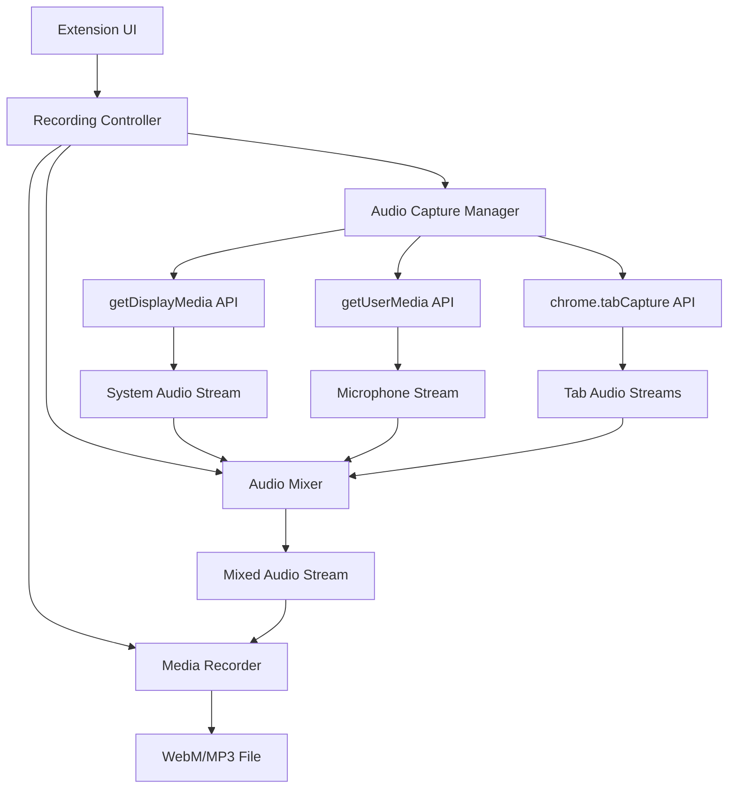

# Design Document: Browser-Wide Audio Recording

## Overview

Thiết kế này mô tả việc cải thiện Chrome extension ghi âm từ việc chỉ capture một tab thành khả năng ghi âm toàn bộ môi trường browser. Giải pháp sử dụng `getDisplayMedia()` API để capture system audio từ tất cả tab, kết hợp với `getUserMedia()` để capture microphone, và Web Audio API để trộn các luồng âm thanh.

**Kiến trúc chính:**
- **Primary Approach**: Sử dụng `getDisplayMedia()` với system audio capture
- **Fallback Approach**: Sử dụng `chrome.tabCapture` API cho từng tab
- **Audio Processing**: Web Audio API để trộn và đồng bộ
- **Recording**: MediaRecorder API để xuất file

## Architecture

### High-Level Architecture



### Component Architecture

**Extension Structure:**
- **Service Worker**: Quản lý lifecycle và permissions
- **Offscreen Document**: Xử lý audio capture và recording
- **Popup UI**: Interface điều khiển ghi âm
- **Content Scripts**: Không cần thiết cho audio capture

## Components and Interfaces

### 1. Recording Controller

**Responsibility**: Điều phối toàn bộ quá trình ghi âm

```typescript
interface RecordingController {
  startRecording(options: RecordingOptions): Promise<void>
  pauseRecording(): Promise<void>
  resumeRecording(): Promise<void>
  stopRecording(): Promise<Blob>
  getRecordingState(): RecordingState
  getRecordingDuration(): number
}

interface RecordingOptions {
  includeSystemAudio: boolean
  includeMicrophone: boolean
  audioQuality: AudioQuality
  outputFormat: 'webm' | 'mp3'
}

enum RecordingState {
  IDLE = 'idle',
  STARTING = 'starting',
  RECORDING = 'recording',
  PAUSED = 'paused',
  STOPPING = 'stopping',
  ERROR = 'error'
}
```

### 2. Audio Capture Manager

**Responsibility**: Quản lý việc capture audio từ nhiều nguồn

```typescript
interface AudioCaptureManager {
  initializeSystemAudio(): Promise<MediaStream>
  initializeMicrophone(): Promise<MediaStream>
  initializeTabCapture(): Promise<MediaStream[]>
  releaseAllStreams(): void
  getAvailableAudioSources(): AudioSource[]
}

interface AudioSource {
  id: string
  type: 'system' | 'microphone' | 'tab'
  name: string
  stream: MediaStream
  isActive: boolean
}
```

**Implementation Strategy:**

1. **Primary Method - getDisplayMedia():**
   ```typescript
   async initializeSystemAudio(): Promise<MediaStream> {
     try {
       const stream = await navigator.mediaDevices.getDisplayMedia({
         video: false,
         audio: {
           echoCancellation: false,
           noiseSuppression: false,
           autoGainControl: false,
           systemAudio: 'include'
         }
       });
       return stream;
     } catch (error) {
       // Fallback to tab capture
       return this.initializeTabCapture();
     }
   }
   ```

2. **Fallback Method - chrome.tabCapture:**
   ```typescript
   async initializeTabCapture(): Promise<MediaStream[]> {
     const tabs = await chrome.tabs.query({ audible: true });
     const streams: MediaStream[] = [];
     
     for (const tab of tabs) {
       try {
         const streamId = await chrome.tabCapture.getMediaStreamId({
           targetTabId: tab.id
         });
         const stream = await navigator.mediaDevices.getUserMedia({
           audio: {
             mandatory: {
               chromeMediaSource: 'tab',
               chromeMediaSourceId: streamId
             }
           }
         });
         streams.push(stream);
       } catch (error) {
         console.warn(`Failed to capture tab ${tab.id}:`, error);
       }
     }
     
     return streams;
   }
   ```

### 3. Audio Mixer

**Responsibility**: Trộn và đồng bộ nhiều luồng âm thanh

```typescript
interface AudioMixer {
  addAudioSource(source: AudioSource): void
  removeAudioSource(sourceId: string): void
  setSourceVolume(sourceId: string, volume: number): void
  getMixedStream(): MediaStream
  getAudioContext(): AudioContext
}

class WebAudioMixer implements AudioMixer {
  private audioContext: AudioContext
  private destination: MediaStreamAudioDestinationNode
  private sources: Map<string, AudioSourceNode>
  
  constructor() {
    this.audioContext = new AudioContext()
    this.destination = this.audioContext.createMediaStreamDestination()
    this.sources = new Map()
  }
  
  addAudioSource(source: AudioSource): void {
    const sourceNode = this.audioContext.createMediaStreamSource(source.stream)
    const gainNode = this.audioContext.createGain()
    
    sourceNode.connect(gainNode)
    gainNode.connect(this.destination)
    
    this.sources.set(source.id, {
      sourceNode,
      gainNode,
      source
    })
  }
  
  getMixedStream(): MediaStream {
    return this.destination.stream
  }
}
```

### 4. Media Recorder Manager

**Responsibility**: Ghi và xuất file âm thanh

```typescript
interface MediaRecorderManager {
  startRecording(stream: MediaStream, options: RecordingOptions): void
  pauseRecording(): void
  resumeRecording(): void
  stopRecording(): Promise<Blob>
  getRecordedData(): Blob[]
}

class WebMRecorderManager implements MediaRecorderManager {
  private mediaRecorder: MediaRecorder
  private recordedChunks: Blob[] = []
  
  startRecording(stream: MediaStream, options: RecordingOptions): void {
    const mimeType = options.outputFormat === 'webm' 
      ? 'audio/webm;codecs=opus'
      : 'audio/mp4'
      
    this.mediaRecorder = new MediaRecorder(stream, {
      mimeType,
      audioBitsPerSecond: this.getAudioBitrate(options.audioQuality)
    })
    
    this.mediaRecorder.ondataavailable = (event) => {
      if (event.data.size > 0) {
        this.recordedChunks.push(event.data)
      }
    }
    
    this.mediaRecorder.start(1000) // Collect data every second
  }
}
```

### 5. Permission Manager

**Responsibility**: Quản lý quyền truy cập và fallback

```typescript
interface PermissionManager {
  requestDisplayMediaPermission(): Promise<boolean>
  requestMicrophonePermission(): Promise<boolean>
  checkTabCapturePermission(): Promise<boolean>
  getPermissionStatus(): PermissionStatus
}

interface PermissionStatus {
  displayMedia: 'granted' | 'denied' | 'prompt'
  microphone: 'granted' | 'denied' | 'prompt'
  tabCapture: 'granted' | 'denied'
}
```

## Data Models

### Recording Session

```typescript
interface RecordingSession {
  id: string
  startTime: Date
  endTime?: Date
  duration: number
  audioSources: AudioSource[]
  options: RecordingOptions
  state: RecordingState
  outputFile?: Blob
  metadata: RecordingMetadata
}

interface RecordingMetadata {
  sampleRate: number
  bitRate: number
  channels: number
  format: string
  size: number
}
```

### Audio Configuration

```typescript
interface AudioConfiguration {
  systemAudio: {
    enabled: boolean
    volume: number
    sampleRate: number
  }
  microphone: {
    enabled: boolean
    volume: number
    echoCancellation: boolean
    noiseSuppression: boolean
    autoGainControl: boolean
  }
  output: {
    format: 'webm' | 'mp3'
    quality: AudioQuality
    bitRate: number
  }
}

enum AudioQuality {
  LOW = 'low',      // 64 kbps
  MEDIUM = 'medium', // 128 kbps
  HIGH = 'high',     // 256 kbps
  LOSSLESS = 'lossless' // 320 kbps
}
```

## Correctness Properties

*A property is a characteristic or behavior that should hold true across all valid executions of a system-essentially, a formal statement about what the system should do. Properties serve as the bridge between human-readable specifications and machine-verifiable correctness guarantees.*

Trước khi viết các correctness properties, tôi cần phân tích các acceptance criteria từ requirements để xác định những gì có thể test được.

### Property 1: System Audio Capture Completeness
*For any* set of active browser tabs with audio, when recording starts, all audible tab audio streams should be captured and included in the recording
**Validates: Requirements 1.1**

### Property 2: Recording Resilience
*For any* recording session, when an audio source becomes unavailable, the recording should continue with remaining sources without data loss or interruption
**Validates: Requirements 1.3, 2.4**

### Property 3: Microphone Integration
*For any* recording session with microphone enabled, both system audio and microphone audio should be captured concurrently and mixed into the output stream
**Validates: Requirements 2.2, 2.3**

### Property 4: Audio Mixing Preservation
*For any* set of input audio streams, the mixed output stream should contain audio data from all input sources while maintaining the original audio quality characteristics
**Validates: Requirements 3.1, 3.3**

### Property 5: Volume Control Independence
*For any* audio source in the mixer, adjusting its volume should only affect that source's contribution to the mixed output without affecting other sources
**Validates: Requirements 3.4**

### Property 6: Recording State Transitions
*For any* recording session, state transitions (start → recording → paused → resumed → stopped) should occur correctly with appropriate data handling at each transition
**Validates: Requirements 4.1, 4.2, 4.3, 4.4**

### Property 7: Real-time Duration Tracking
*For any* active recording session, the displayed recording duration should accurately reflect the actual elapsed recording time
**Validates: Requirements 4.5**

### Property 8: File Export Completeness
*For any* completed recording session, the exported file should contain all recorded audio data in the specified format (WebM or MP3)
**Validates: Requirements 5.1, 5.2**

### Property 9: Export Progress Indication
*For any* file export operation, progress updates should be provided throughout the export process until completion or failure
**Validates: Requirements 5.4, 5.5**

### Property 10: Permission Handling Resilience
*For any* permission denial or revocation, the system should gracefully degrade functionality and provide appropriate user guidance
**Validates: Requirements 6.3, 6.5**

### Property 11: Audio Quality Standards
*For any* recorded audio, the output should meet minimum quality standards (44.1kHz sample rate, 16-bit depth or higher)
**Validates: Requirements 7.1, 7.2**

### Property 12: API Fallback Reliability
*For any* scenario where getDisplayMedia API is unavailable, the system should automatically fallback to chrome.tabCapture API without user intervention
**Validates: Requirements 8.1**

### Property 13: Error Recovery with Data Preservation
*For any* recoverable error during recording, the system should attempt recovery while preserving all previously recorded data
**Validates: Requirements 8.2, 8.3**

### Property 14: Error Communication
*For any* error condition, clear and actionable error messages should be displayed to the user
**Validates: Requirements 8.4**

## Error Handling

### Error Categories

1. **Permission Errors**
   - Microphone access denied
   - Display media access denied
   - Tab capture permission missing

2. **API Availability Errors**
   - getDisplayMedia not supported
   - MediaRecorder not supported
   - Web Audio API not available

3. **Runtime Errors**
   - Audio stream interruption
   - Recording device disconnection
   - Memory/storage limitations

4. **Export Errors**
   - File system access denied
   - Insufficient storage space
   - Format conversion failures

### Error Handling Strategies

**Graceful Degradation:**
```typescript
class ErrorHandler {
  async handlePermissionError(error: PermissionError): Promise<void> {
    switch (error.type) {
      case 'microphone-denied':
        // Continue with system audio only
        await this.continueWithSystemAudioOnly()
        this.showUserNotification('Recording without microphone')
        break
      case 'display-media-denied':
        // Fallback to tab capture
        await this.fallbackToTabCapture()
        break
    }
  }
  
  async handleStreamInterruption(streamId: string): Promise<void> {
    // Remove failed stream from mixer
    this.audioMixer.removeAudioSource(streamId)
    // Continue recording with remaining streams
    if (this.audioMixer.hasActiveStreams()) {
      this.continueRecording()
    } else {
      this.stopRecordingWithError('All audio sources lost')
    }
  }
}
```

**Data Recovery:**
```typescript
class RecordingRecovery {
  async savePartialRecording(recordedChunks: Blob[]): Promise<void> {
    try {
      const partialBlob = new Blob(recordedChunks, { type: 'audio/webm' })
      await this.saveToStorage(partialBlob, 'partial-recording')
      this.notifyUser('Partial recording saved due to error')
    } catch (saveError) {
      this.notifyUser('Unable to save recording data')
    }
  }
}
```

## Testing Strategy

### Dual Testing Approach

**Unit Tests:**
- Test specific component behaviors and edge cases
- Mock external APIs for controlled testing
- Focus on error conditions and boundary cases
- Test UI interactions and state management

**Property-Based Tests:**
- Verify universal properties across all inputs
- Test with randomized audio streams and configurations
- Validate correctness properties with minimum 100 iterations per test
- Each property test references its design document property

**Property Test Configuration:**
- Use a property-based testing library appropriate for the target language (JavaScript/TypeScript)
- Configure each test to run minimum 100 iterations due to randomization
- Tag each test with format: **Feature: browser-wide-audio-recording, Property {number}: {property_text}**

**Testing Focus Areas:**

1. **Audio Stream Management**
   - Property tests for stream mixing and synchronization
   - Unit tests for stream lifecycle management
   - Edge cases: stream interruption, device changes

2. **Recording State Management**
   - Property tests for state transitions
   - Unit tests for pause/resume functionality
   - Edge cases: rapid state changes, concurrent operations

3. **File Export and Quality**
   - Property tests for format conversion and quality preservation
   - Unit tests for export progress and error handling
   - Edge cases: large files, storage limitations

4. **Permission and API Handling**
   - Property tests for fallback mechanisms
   - Unit tests for permission flows
   - Edge cases: permission revocation, API unavailability

**Mock Strategy:**
- Mock Chrome APIs (chrome.tabCapture, chrome.runtime)
- Mock Web APIs (MediaDevices, MediaRecorder, AudioContext)
- Create test audio streams for consistent testing
- Simulate various error conditions and edge cases